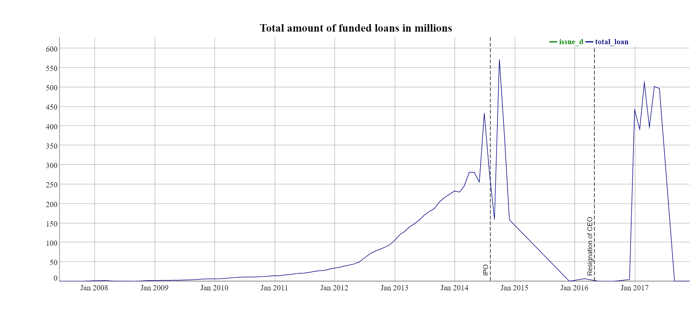
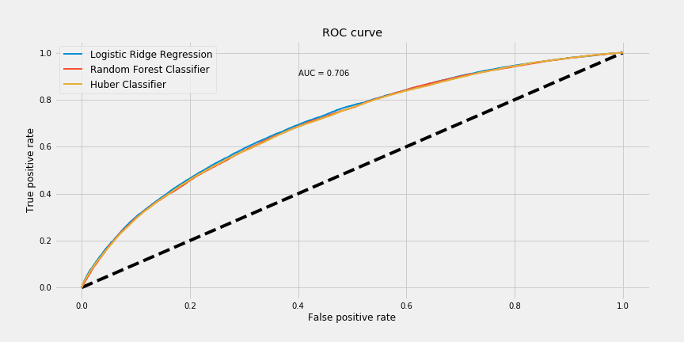

## Motivation
When I was first looking for a project to work on for Insight, I considered a few variations of stock market prediction using machine 
learning techniques. What I didn't know that time was that such projects were fairly common and that predicting any sort of price forecast is an exceptionally challenging problem and [not fundamentally feasible](https://www.investopedia.com/terms/e/efficientmarkethypothesis.asp). I wanted to work on a finance related project and someone suggested that I look in [peer-to-peer lending](https://en.wikipedia.org/wiki/Peer-to-peer_lending). I had never heard of it before but after a day of reading, got immediately hooked and decided to work on project related to peer-to-peer lending. The project would be finance related, there were many data science techniques one could use to tackle important problems in that space, the problems clearly stemmed from a business need and finally, it would be fun to work in a completely new field. This checked all boxes that I wanted for a project!

## What is peer-to-peer lending? <a id='motivation'></a>

Peer-to-peer lending is a way for individual investors to lend money directly to borrowers. The peer-to-peer lending industry seeks to create a market where investors (individuals or institutions) can buy loans directly from the originator, without the need of a banking intermediary. A low-cost operating model for peer-to-peer lending platforms allows for lower rates for borrowers as well as solid returns for investors. 

Here's how it works. Borrowers enter in a few personal and loan details. The lending platform runs a soft credit check and if the loan is approved, displays an interest rate that the borrower will need to pay. If the borrower accepts this rate, the loan becomes public and is passed on to a pool which investors have access to. Investors can search and browse the loan listings  and select loans that they want to invest in based on the information supplied about the borrower, amount of loan, interest rate, and loan purpose. Investors make money from interest. The loans are for a fixed duration and borrowers are required to pay monthly installments. 

## Context and need <a id='need'></a>
In spite of the lending platforms' efforts to screen out high risk borrowers, a significant portion of borrowers [default](https://www.finextra.com/newsarticle/30165/high-rate-of-defaults-hit-p2p-lending-sector), and this hurts investors' returns. Moreover, loans on lending platforms are not collateralized and default risk directly impacts an investor's returns.  Given all this, how can we improve returns for investors?

## Data <a id='data'></a>
I looked at loan data from [Lending Club](https://www.lendingclub.com/info/download-data.action), one of the biggest online lending latforms in the United States. The dataset I used for training my models had over 300000 rows (loans) and each row contained information about a loan (purpose, amount, interest rate, credit history of the borrower) and all completed loans contain information about the status of the loan (Paid off or Defaulted). The goal of my project was to improve returns for Lending club investors. 

### Overview <a id='overview'></a>
One way to improve returns is by reliably predicting loan default. I approached the problem of prediciting loan default in two ways. One was to look at it as a supervised classfication problem that predicts whether a given loan will default. The aim here was to filter 
out as many bad loans as possible. With that in mind, I used a few parameteric and non-parametric classfiers and optimized for *recall*. 

This binary approach does not bode particularly well for maximizing returns and such analysis has been done before for Lending Club's data. For example, a high interest loan defaulting near the end of the term and a low interest loan defaulting near the beginning of the term will have different returns, and will be binned in the same category by the binary classifer. A more satisfactory approach is to predict the time to default. This was done using survival analysis. 

Using the predicted time to default, an investment strategy was constructed to select optimal loans and was tested with unseen data. I used a combination of R and Python for my analysis. 

### Workflow

The project comprised of four parts:

**Exploratory analysis of historical data from Lending Club from 2007-2017**. I deployed a R Shiny [dashboard](https://puzzle-toad.shinyapps.io/peer_to_peer_lending/) for a visual exploration of historical Lending Club data. (Detailed code [here](https://github.com/iyer-karthik/Insight-project/tree/master/shiny) and [here](https://github.com/iyer-karthik/Insight-project/blob/master/EDA.ipynb)). One thing stood out: The growth of the platform itself, measured in terms of amount of money disbursed.




**Supervised binary classification**:
With the aim of improving returns, the first technique I used was a supervised binary classification; predict whether a given loan will default or not. The idea was to improve returns by avoiding bad loans. I used a few parametric and non-parametric classifiers and optimized for recall. Logistic regression with L2 penalty had the best ROC-AUC. 

Here is the ROC curve for different classifiers. 



This solved the problem (avoid all loans which are predicted to default and increase returns), but the solution is not too satisfactory. 


**Survival analysis**:
A disadvantage of classification techniques is that they do not take the timing of default into account. When using survival analysis, we are able to predict when customers are likely to default. When using traditional classification techniques, it is not possible to include the information regarding a current loan as an input in the model. Focusing on the time aspect of default, information such as “borrower X with characteristics Y has at least been repaying for Z months” can be taken into account. I used Cox proportional Hazard Model to predict probability of survival for loans. 

Here is the output for a random loan whose maturity period is 36 months.


*Using the probability of survival allows us to compute expected lifetime which can be used to compute expected returns*. For instance, this is a code snippet which computes internal rate of return which can then be used to compute the annual expected return. 

```python
MAX_LOG_RATE = 1e3
BASE_TOL = 1e-12

def better_irr_newton(my_list, tol=BASE_TOL):
    
    ''' 
    Compute the internal rate of return. This is the 
    “average” periodically compounded rate of return 
    that gives a net present value of 0.0; 
    Uses Newton Raphson. 
    
    Parameters:	
    my_list : array_like, shape(N,)

    Returns:	
    out : float
    
    '''    
   rate = 0.0
    for steps in range(50):
        r = np.arange(len(my_list))
        # Factor exp(m) out of the numerator & denominator for numerical stability
        m = max(-rate * r)
        factor = np.exp(-rate * r - m)
        
        t = np.dot(factor, my_list)
        if abs(t) < tol * math.exp(-m):
            break
        u = np.dot(factor * r, my_list)
        # Clip the update to prevent jumping into region of numerical instability
        rate = rate + np.clip(t / u, -1.0, 1.0)

    return math.exp(rate) - 1
```
**Investment strategy**:
What does all of give us? It gives a way to rank all the loans. *The investment strategy is to invest only in top performing loans, where performance is measured by expected returns.* As a way to validate the strategy, we then rank all loans in the test set by their expected returns, bin them in to top 20 %, 20-40 % and so on, and then compare the results in each bin to actual observed returns.

The idea sounds simple enough. Let's test the robustness of the strategy! 

Here is a comparison of the average expected return and average observed return in each bin. 


This strategy performs well on back-test and picks out the top performing loans. 

### Insights <a id='insights'></a>
Classification and survival analysis models also output factors most indicative of default. Here are some key insights:
- Loan-to-income ratio is the top predictor of loan default. A higher loan-to-income ratio corresponds to a smaller number of 
payments. 
- Loan description is a good predictor of loan default, especially description polarity.
- Loan purpose plays a role in default outcome. Wedding loans have a tendency to be paid off while loans for small businesses have a
greater tendency to default.
- Surprisngly, the number of tax liens is inversely associated with default.

### Use case <a id='usecase'></a>
Once the model parameters have been determined using survival analysis, calculating expected returns is straightforward and can be done in real-time when new investment opportunities arise. An investor looking in to Lending club loans has access to features which go in to the model. Computing the expected returns gives her a way to rank the loans and choose only the top performing loans.


### Summary <a id='summary'></a>
 Here is a summary of work accomplished over the last 3 weeks:
- Deployed a R Shiny dashboard visualizing the historical trends in Lending Club loan data
- Used classfication techniques to predict whether a loan will default
- Used survival analysis techniques to predict time to default and constructed an investment strategy off that
- Provided actionable insights for optimal loan selection

